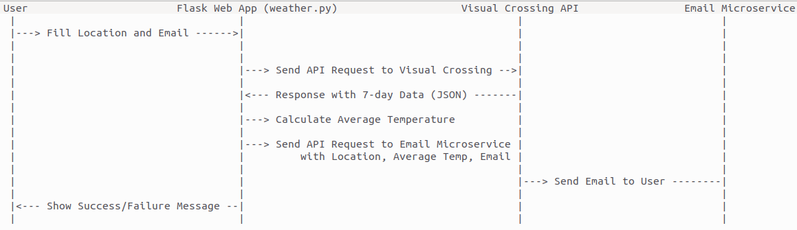

# Microservices Project

---

## Introduction

This project uses two Python scripts to create two different components for the same application, which can then be containerized and deployed on a Kubernetes (K8s) cluster. The main component communicates with the email component's service in Kubernetes as an API endpoint.

---

## Project Flow

  

---

## Features

- The application retrieves weather forecast data.
- The application sends an email to the user with the average temperature.

---

## Prerequisites

- Python installed
- Docker installed for building images
- Access to a Kubernetes (K8s) cluster

